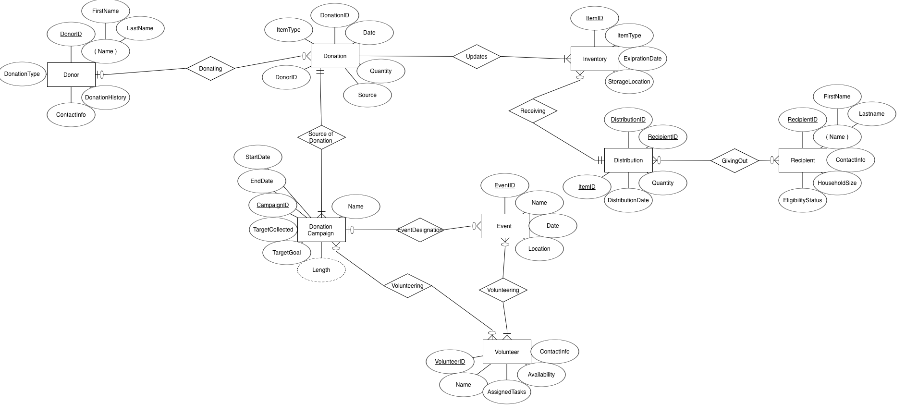
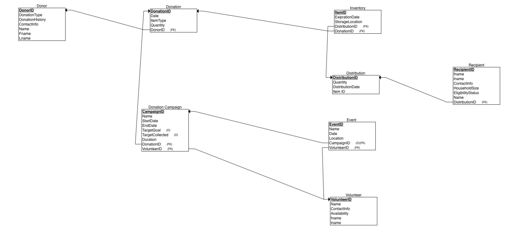

# Edmonton Food Bank Operational Database

## Problem Statement 

Food insecurity is becoming a growing concern nationwide, and we see record-high costs due to inflation. Because of this, the number of families and individuals that rely on food banks has been rising, and the demand for food banks has increased dramatically. In my hometown of Edmonton, new food banks have opened that deal with millions of donations and customers annually. I will focus the project on a local food bank called Edmonton’s Food Bank, which serves my local community. The project aims to develop a database solution that will provide a comprehensive and structured approach that will assist with managing donations, inventory, and recipient records, maximizing efficiency and reducing waste, all to serve the community effectively.

## Scope 

This database solution is designed to address the operational needs of a local food bank in Edmonton, improving its ability to manage food donations, inventory, and distributions while supporting community engagement initiatives. The system will track donations made by individual and corporate donors, ensuring each donation is recorded with details about the donor, donation type, and quantity. These donations will feed into an inventory management system that monitors stock levels, expiration dates, and storage locations, enabling the food bank to minimize waste and optimize resource allocation. 

The database will also maintain detailed recipient records, tracking their eligibility status and household information to ensure fair and efficient distribution of resources. Distribution records will log the specific items provided to recipients, linking inventory usage to community impact. Additionally, the system will facilitate the management of donation campaigns and events. Each campaign will include detailed records such as its goals, timelines, and associated donations, providing insights into its success. Events organized to support these campaigns will also be tracked, including information on volunteer participation. Volunteers will have individual profiles in the system detailing their assigned tasks and involvement in events or campaigns.

This comprehensive database will integrate open data sources on food insecurity and demographic statistics for Edmonton, allowing stakeholders to analyze donation trends, campaign performance, and regional impact. Simulated transaction data will be generated to demonstrate the database’s functionality and scalability in supporting the food bank's mission to alleviate food insecurity in the Edmonton community.

## Entity Relationship Model



## Relational Model



## Source Code

* [Create Script](Create.sql)
* [Drop Script](drop.sql)
* [Populate Script](population.sql)
* [Query Script](query.sql)

## Sample Queries

### Query 1

Find Total Donations Made by Each Donor

```
SELECT d.donorid, d.name, SUM(dn.quantity) AS total_donated
FROM Donor d
JOIN Donation dn ON d.donorid = dn.donorid
GROUP BY d.donorid, d.name
ORDER BY total_donated DESC;
```

### Query 2

List All Recipients Along with Their Last Received Distribution Date

```
SELECT r.recipientid, r.name, MAX(d.distributiondate) AS last_distribution_date
FROM Recipient r
JOIN Distribution d ON r.distributionid = d.distributionid
GROUP BY r.recipientid, r.name
ORDER BY last_distribution_date DESC;
```

### Query 3

Find the Most Donated Item Type and Its Total Quantity

```
SELECT itemtype, SUM(quantity) AS total_quantity
FROM Donation
GROUP BY itemtype
ORDER BY total_quantity DESC;
```

### Query 4

List Events Along with Their Associated Campaign and Assigned Volunteers

```
SELECT e.eventid, e.name AS event_name, e.date, e.location, 
       dc.name AS campaign_name, v.name AS volunteer_name
FROM Event e
JOIN Donation_Campaign dc ON e.campaignid = dc.campaignid
JOIN Volunteer v ON e.volunteerid = v.volunteerid
ORDER BY e.date DESC;
```

### Query 5

Calculate the Average Household Size of Recipients and Total Aid Distributed

```
SELECT 
    AVG(r.householdsize) AS avg_household_size, 
    SUM(d.quantity) AS total_distributed
FROM Recipient r
JOIN Distribution d ON r.distributionid = d.distributionid;
```


